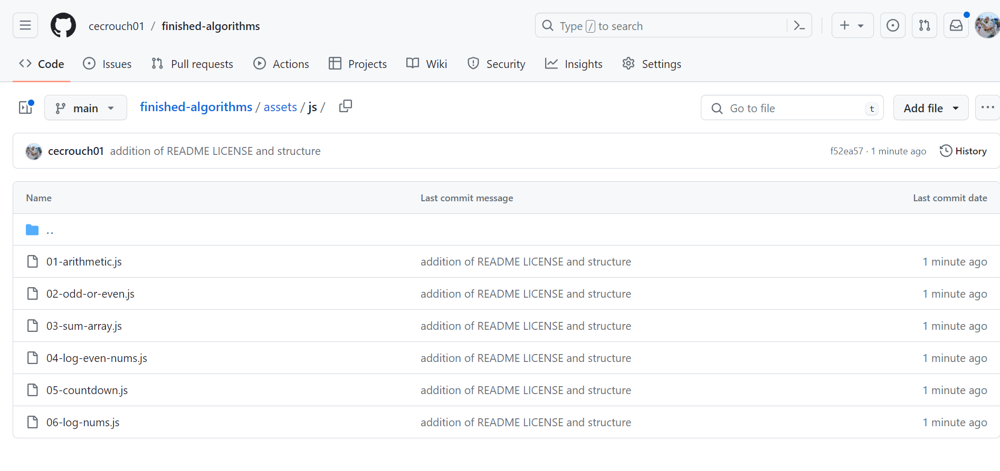

# Finished Algorithms

## Description

This is to be used as a way to showcase what algorithms I have been practicing to hone my craft. As a new web developer I want to show where I started and where I am at now. The smaller the number means it is an algorithm I did earlier in my career. What you will end up seeing is a progression of my skill level when I started to the skill level I am currently at. 

## Installation

Go to the link below to peruse the algorithms I have finished. 

https://github.com/cecrouch01/finished-algorithms/tree/main/assets/js

## Usage

Go to the repo link listed below and you will see a list of algorithms similar to the picture attached to this section.

https://github.com/cecrouch01/finished-algorithms/tree/main/assets/js

## Credits

Thank you to Aaron Brown and Grady Peck, two of my mentors, for making this suggestion and helping me out on my journey in learning how to code. 

## License

MIT License

Copyright (c) 2023 Caleb Crouch

Permission is hereby granted, free of charge, to any person obtaining a copy of this software and associated documentation files (the "Software"), to deal in the Software without restriction, including without limitation the rights to use, copy, modify, merge, publish, distribute, sublicense, and/or sell copies of the Software, and to permit persons to whom the Software is furnished to do so, subject to the following conditions:

The above copyright notice and this permission notice shall be included in all copies or substantial portions of the Software.

THE SOFTWARE IS PROVIDED "AS IS", WITHOUT WARRANTY OF ANY KIND, EXPRESS OR IMPLIED, INCLUDING BUT NOT LIMITED TO THE WARRANTIES OF MERCHANTABILITY, FITNESS FOR A PARTICULAR PURPOSE AND NONINFRINGEMENT. IN NO EVENT SHALL THE AUTHORS OR COPYRIGHT HOLDERS BE LIABLE FOR ANY CLAIM, DAMAGES OR OTHER LIABILITY, WHETHER IN AN ACTION OF CONTRACT, TORT OR OTHERWISE, ARISING FROM, OUT OF OR IN CONNECTION WITH THE SOFTWARE OR THE USE OR OTHER DEALINGS IN THE SOFTWARE.

## Badges

